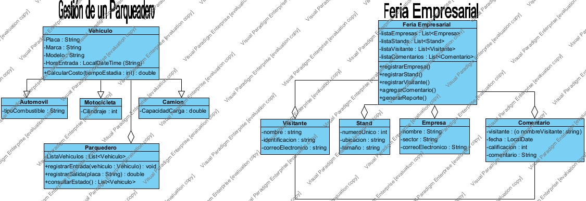

# Gestión de Feria Empresarial 🏢

Este proyecto es una aplicación de consola desarrollada en Java que simula la gestión de una feria empresarial. Permite administrar empresas, stands y visitantes, registrar las interacciones entre ellos y generar reportes detallados. El proyecto fue desarrollado como parte de la guía de "Desarrollo de Software", aplicando los principios de la Programación Orientada a Objetos.

## ✨ Características Principales

El sistema cuenta con las siguientes funcionalidades:

- **Gestión de Empresas:**
  - ✅ Registrar nuevas empresas.
  - ✏️ Editar la información de empresas existentes.
  - ❌ Eliminar empresas del registro.

- **Gestión de Visitantes:**
  - ✅ Registrar nuevos visitantes.
  - ✏️ Editar la información de visitantes.
  - ❌ Eliminar visitantes del registro.

- **Administración de Stands:**
  - ➕ Crear y registrar stands en la feria.
  - 🤝 Asignar stands a empresas específicas.
  - 📊 Listar stands ocupados y disponibles.

- **Sistema de Interacción:**
  - 💬 Permitir que los visitantes dejen comentarios en los stands.
  - ⭐ Asignar una calificación de 1 a 5 estrellas en cada comentario.

- **Módulo de Reportes:**
  - 📋 Generar un reporte de todas las empresas y sus stands asignados.
  - 👤 Generar una lista completa de los visitantes registrados.
  - 📈 Calcular y mostrar la calificación promedio que ha recibido cada stand.

## 📐 Diagrama de Clases (UML)

La arquitectura del sistema se basa en el siguiente diagrama de clases, que muestra las relaciones entre las distintas entidades del proyecto.



## 🛠️ Tecnologías Utilizadas

- **Lenguaje:** Java
- **Control de Versiones:** Git
- **Alojamiento:** GitHub

## 🚀 Cómo Ejecutar el Proyecto

Para compilar y ejecutar este proyecto en tu máquina local, sigue estos sencillos pasos.

**Requisitos:**
- Tener instalado el JDK (Java Development Kit) versión 8 o superior.
- Tener Git instalado.

**Pasos:**

1.  **Clona el repositorio:** Abre una terminal o consola y ejecuta el siguiente comando:
    ```bash
    git clone [https://github.com/ValRes0911/FeriaEmpresarial.git](https://github.com/ValRes0911/FeriaEmpresarial.git)
    ```

2.  **Navega al directorio del proyecto:**
    ```bash
    cd FeriaEmpresarial
    ```

3.  **Compila los archivos Java:**
    ```bash
    javac *.java
    ```

4.  **Ejecuta la clase principal:**
    La clase `Main` contiene una simulación que demuestra todas las funcionalidades.
    ```bash
    java Main
    ```

## 👤 Autor

* **Valeri Paola Restrepo Lombana**